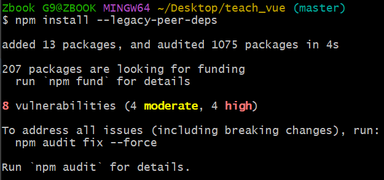
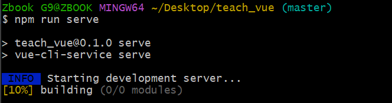
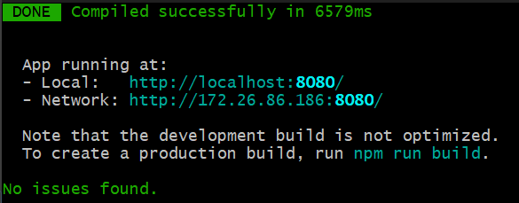
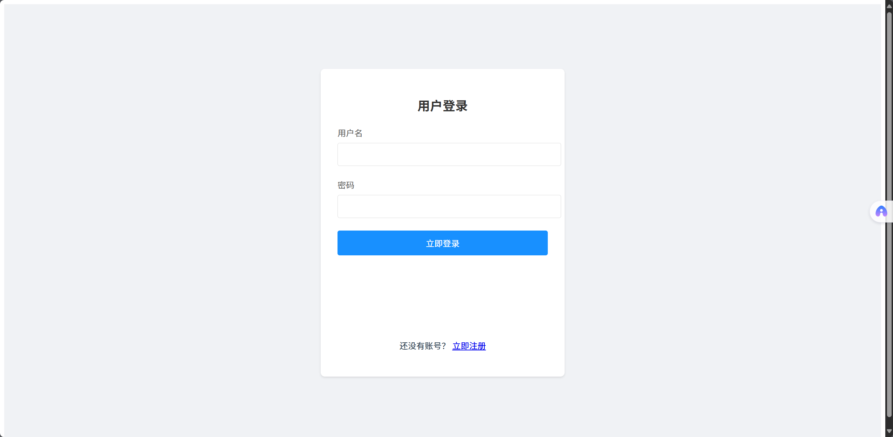

# teach_vue


> [!IMPORTANT]
>
> 项目名称 teach_vue

#### 安装环境

1. 下载nodejs1.1.12并安装

    setup.exe：https://github.com/coreybutler/nvm-windows/releases/download/1.1.12/nvm-setup.exe

2. 在命令提示符中端中输入命令

    ```shell
    nvm install 20
    ```

    ```shell
    nvm use 20.19.1
    ```

    检查是否安装成功

    ```shell
    node -v
    npm -v
    ```

3. 安装`vue`框架

    ```shell
    npm install -g @vue/cli
    ```

    验证

    ```shell
    vue -V
    ```

参考：

[Vue3安装配置+VSCode开发环境搭建，超详细保姆级教程（图文）_vscode vue3-CSDN博客](https://blog.csdn.net/s_naughty/article/details/144981486)

[【安装指南】VSCode搭建运行Vue的详细教程-阿里云开发者社区](https://developer.aliyun.com/article/1433440)

#### 创建项目

```shell
vue create teach_vue
```

项目配置

注意选择手动配置

vue 3.x

不选：

()Unit Testing 单元测试

()E2E Testing 端到端测试

[vue create创建项目手动配置步骤_class-style component syntax-CSDN博客](https://blog.csdn.net/weixin_45032067/article/details/126356391)


启动项目时

```
cd teach_vue
npm run serve
```


## Project setup
```
npm install
```


### Compiles and hot-reloads for development
```
npm run serve
```

### Compiles and minifies for production
```
npm run build
```

### Lints and fixes files
```
npm run lint
```

## 克隆 & 运行项目

> [!TIP] 
>
> 也可以参考以下步骤在本地运行项目


#### 1. 克隆项目到本地

```
git clone https://github.com/Ethan-Zhengsy/teach_vue.git
cd teach_vue
```
#### 2. 安装依赖

```
npm install
```

> [!CAUTION]
>
> 如果出现本地下载的依赖与仓库的不兼容，可以使用这个命令`npm install --legacy-peer-deps`

命令行显示结果可能如下：



#### 3. 启动项目

```
npm run serve
```

命令行显示结果可能如下：



#### 4. 访问网页 



> [!CAUTION]
>
> 这里显示的两个网址都是vue运行得到的网页页面，第一个网址是只能在本地访问，第二个网址是允许让同一片局域网下的其他设备访问。
> 
> 一般情况下，直接 `Ctrl + 左键单击`即可打开页面。如果打不开，可以尝试把网址复制到浏览器地址栏中。

浏览器显示结果可能如下：



### Customize configuration
See [Configuration Reference](https://cli.vuejs.org/config/).
